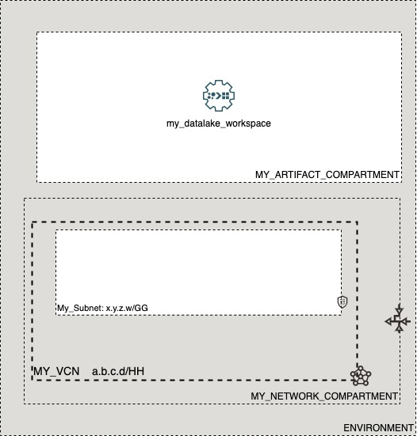

# OCI Cloud Bricks: data integration

[](https://img.shields.io/badge/license-UPL-green) [](https://sonarcloud.io/dashboard?id=oracle-devrel_terraform-oci-cloudbricks-dataintegration)


## Introduction
The following cloudbrick enables you to create a Datalake Workspace inside OCI

## Reference Architecture
The following is the reference architecture associated to this brick



### Prerequisites
- Pre existent Compartment Structure
- Pre existent VCN, Subnet

---
## Sample tfvars file

If the datalake is created on a private subnet

```shell
######################################## COMMON VARIABLES ######################################
region           = "foo-region-1"
tenancy_ocid     = "ocid1.tenancy.oc1..abcdefg"
user_ocid        = "ocid1.user.oc1..aaaaaaabcdefg"
fingerprint      = "fo:oo:ba:ar:ba:ar"
private_key_path = "/absolute/path/to/api/key/your_api_key.pem"
######################################## COMMON VARIABLES ######################################
######################################## ARTIFACT SPECIFIC VARIABLES ######################################
integration_workspace_display_name              = "my-datalake-workspace"
integration_workspace_description               = "Datalake description"
integration_workspace_instance_compartment_name = "MY_ARTIFACT_COMPARTMENT"
integration_workspace_network_compartment_name  = "MY_NETWORK_COMPARTMENT"
workspace_is_private_network_enabled            = true
network_subnet_name                             = "My_Subnet"
vcn_display_name                                = "MY_VCN"
######################################## ARTIFACT SPECIFIC VARIABLES ######################################
```

If the datalake is created on a public endpoint

```shell
######################################## COMMON VARIABLES ######################################
region           = "foo-region-1"
tenancy_ocid     = "ocid1.tenancy.oc1..abcdefg"
user_ocid        = "ocid1.user.oc1..aaaaaaabcdefg"
fingerprint      = "fo:oo:ba:ar:ba:ar"
private_key_path = "/absolute/path/to/api/key/your_api_key.pem"
######################################## COMMON VARIABLES ######################################
######################################## ARTIFACT SPECIFIC VARIABLES ######################################
integration_workspace_display_name              = "my_datalake_workspace"
integration_workspace_description               = "Datalake description"
integration_workspace_instance_compartment_name = "MY_ARTIFACT_COMPARTMENT"
integration_workspace_network_compartment_name  = "MY_NETWORK_COMPARTMENT"
workspace_is_private_network_enabled            = false
######################################## ARTIFACT SPECIFIC VARIABLES ######################################
```


### Variable specific considerations

- If the datalake is created on a private subnet, the following variables are mandatory: 
  - `workspace_is_private_network_enabled` must be set to `true`
  - `network_subnet_name` and `vcn_display_name` must be provided
- In any other case, only variable `workspace_is_private_network_enabled` must be set to `false` dropping the need of the subsequent variables

## Sample provider
```shell
terraform {
  required_version = ">= 0.13.5"
}
provider "oci" {
  region       = var.region
  tenancy_ocid = var.tenancy_ocid
  user_ocid        = var.user_ocid
  fingerprint      = var.fingerprint
  private_key_path = var.private_key_path
  disable_auto_retries = "true"
}

provider "oci" {
  alias        = "home"
  region       = data.oci_identity_region_subscriptions.home_region_subscriptions.region_subscriptions[0].region_name
  tenancy_ocid = var.tenancy_ocid  
  user_ocid        = var.user_ocid
  fingerprint      = var.fingerprint
  private_key_path = var.private_key_path
  disable_auto_retries = "true"
}
```
---

## Variable documentation

## Requirements

| Name | Version |
|------|---------|
| <a name="requirement_terraform"></a> [terraform](#requirement\_terraform) | >= 0.13.5 |

## Providers

| Name | Version |
|------|---------|
| <a name="provider_oci"></a> [oci](#provider\_oci) | n/a |

## Modules

No modules.

## Resources

| Name | Type |
|------|------|
| [oci_dataintegration_workspace.Workspace](https://registry.terraform.io/providers/hashicorp/oci/latest/docs/resources/dataintegration_workspace) | resource |
| [oci_core_subnets.SUBNET](https://registry.terraform.io/providers/hashicorp/oci/latest/docs/data-sources/core_subnets) | data source |
| [oci_core_vcns.VCN](https://registry.terraform.io/providers/hashicorp/oci/latest/docs/data-sources/core_vcns) | data source |
| [oci_identity_compartments.COMPARTMENTS](https://registry.terraform.io/providers/hashicorp/oci/latest/docs/data-sources/identity_compartments) | data source |
| [oci_identity_compartments.NWCOMPARTMENTS](https://registry.terraform.io/providers/hashicorp/oci/latest/docs/data-sources/identity_compartments) | data source |

## Inputs

| Name | Description | Type | Default | Required |
|------|-------------|------|---------|:--------:|
| <a name="input_fingerprint"></a> [fingerprint](#input\_fingerprint) | API Key Fingerprint for user\_ocid derived from public API Key imported in OCI User config | `any` | n/a | yes |
| <a name="input_integration_workspace_description"></a> [integration\_workspace\_description](#input\_integration\_workspace\_description) | Description of the integration workspace | `any` | n/a | yes |
| <a name="input_integration_workspace_display_name"></a> [integration\_workspace\_display\_name](#input\_integration\_workspace\_display\_name) | Display name of the integration workspace | `any` | n/a | yes |
| <a name="input_integration_workspace_instance_compartment_name"></a> [integration\_workspace\_instance\_compartment\_name](#input\_integration\_workspace\_instance\_compartment\_name) | Compartment name where the integration workspace instance will be created | `any` | n/a | yes |
| <a name="input_integration_workspace_network_compartment_name"></a> [integration\_workspace\_network\_compartment\_name](#input\_integration\_workspace\_network\_compartment\_name) | Compartment name where the integration workspace network will be created | `any` | n/a | yes |
| <a name="input_network_subnet_name"></a> [network\_subnet\_name](#input\_network\_subnet\_name) | Display name of the subnet | `any` | n/a | yes |
| <a name="input_private_key_path"></a> [private\_key\_path](#input\_private\_key\_path) | Private Key Absolute path location where terraform is executed | `any` | n/a | yes |
| <a name="input_region"></a> [region](#input\_region) | Target region where artifacts are going to be created | `any` | n/a | yes |
| <a name="input_tenancy_ocid"></a> [tenancy\_ocid](#input\_tenancy\_ocid) | OCID of tenancy | `any` | n/a | yes |
| <a name="input_user_ocid"></a> [user\_ocid](#input\_user\_ocid) | User OCID in tenancy. | `any` | n/a | yes |
| <a name="input_vcn_display_name"></a> [vcn\_display\_name](#input\_vcn\_display\_name) | Display name of the VCN | `any` | n/a | yes |
| <a name="input_workspace_is_private_network_enabled"></a> [workspace\_is\_private\_network\_enabled](#input\_workspace\_is\_private\_network\_enabled) | Enable/Disable private network for the integration workspace | `bool` | `false` | no |

## Outputs

| Name | Description |
|------|-------------|
| <a name="output_dataintegrationworkspace"></a> [dataintegrationworkspace](#output\_dataintegrationworkspace) | Workspace Object |
## Contributing
This project is open source.  Please submit your contributions by forking this repository and submitting a pull request!  Oracle appreciates any contributions that are made by the open source community.

## License
Copyright (c) 2021 Oracle and/or its affiliates.

Licensed under the Universal Permissive License (UPL), Version 1.0.

See [LICENSE](LICENSE) for more details.
